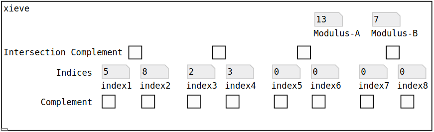

# xieve

xieve is an implementation of Xenakis’ sieve technique of series generation in Pure Data. The versatility of the Pure Data environment allows the output of the object (a number series) to be used in a myriad of constructions from scales and harmonies to rhythmic patterns and envelopes; anything that can accept a sequence of integers. In addition, this program expands on the original sieve software designed by Xenakis (1990) by allowing for the then-unfeasible ability to realize Xenakis’ conception of metabolae (transformations of the sieve) in real time.

